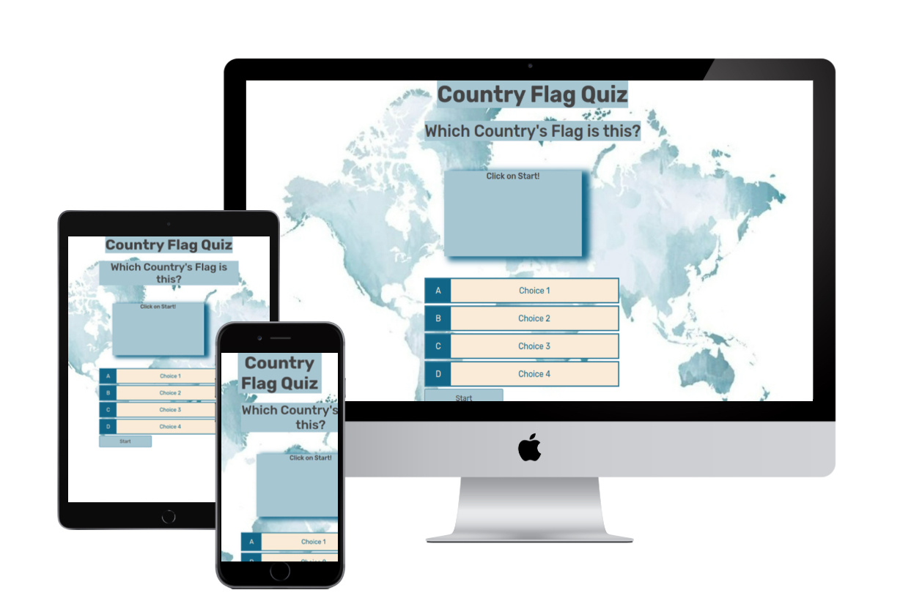
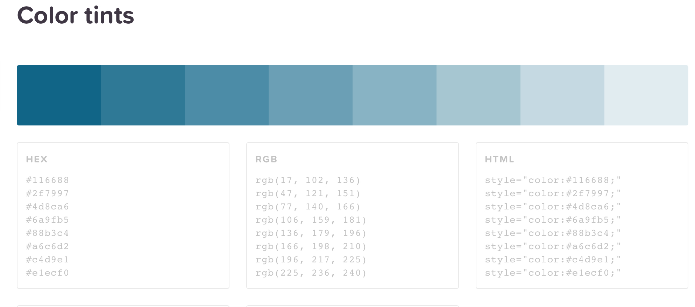
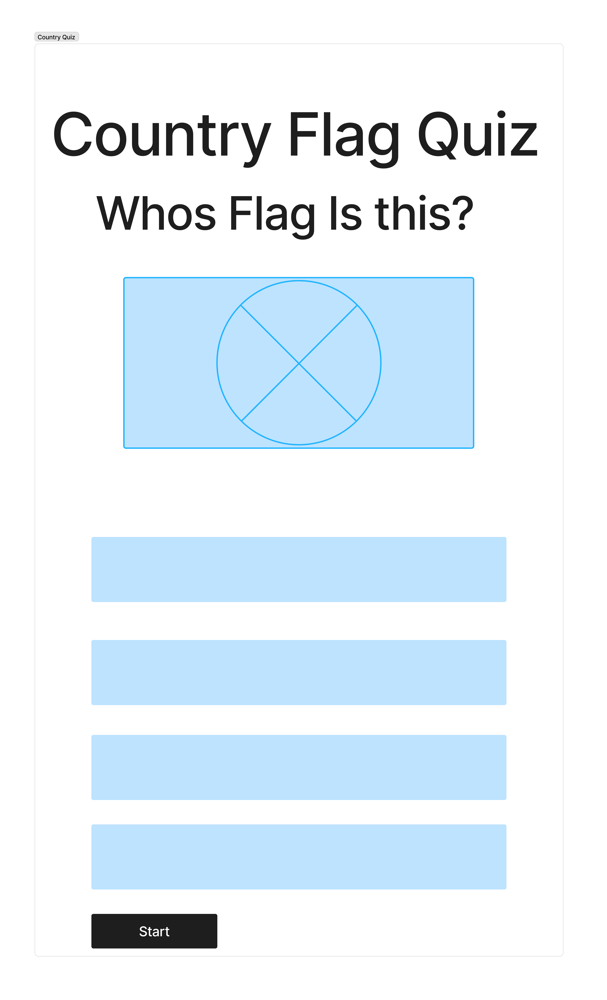
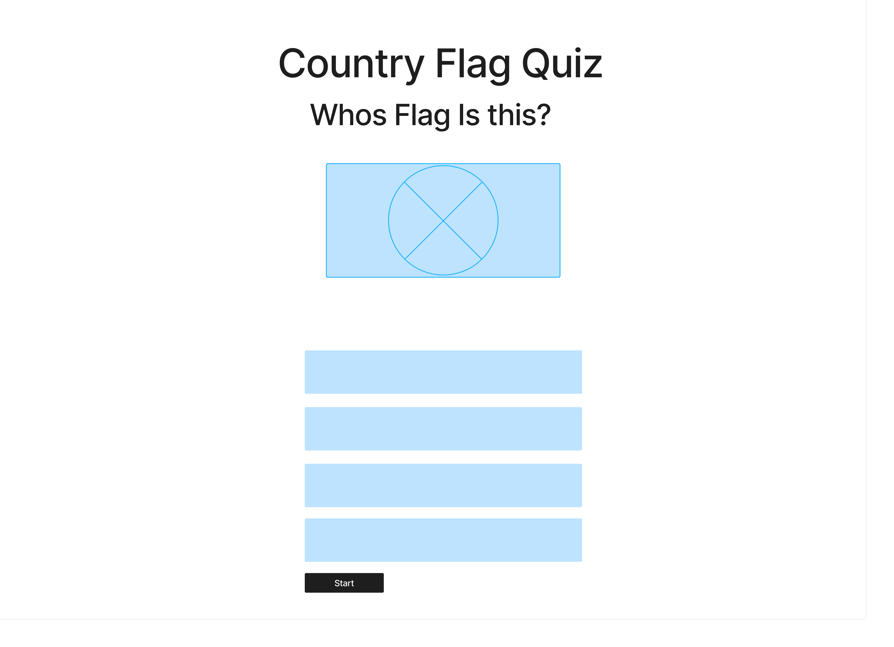
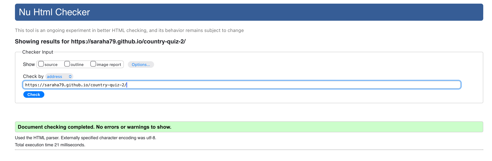
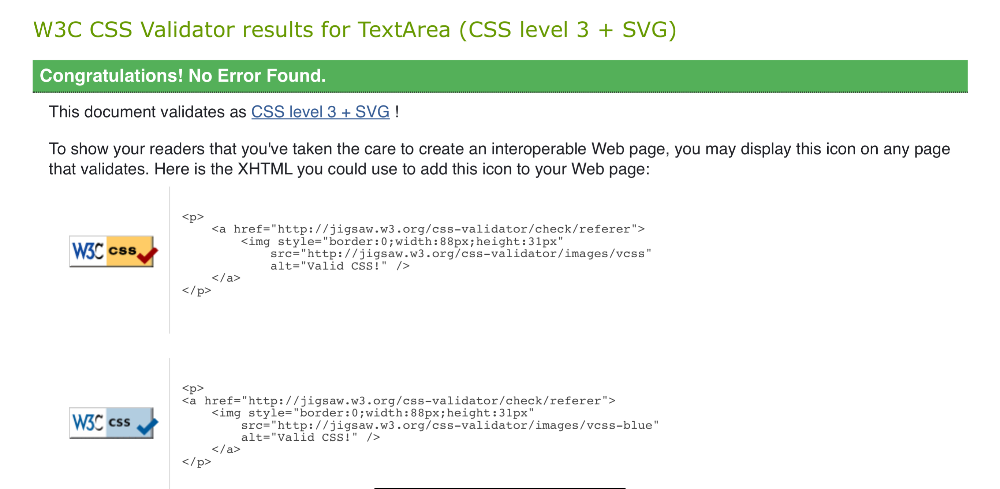
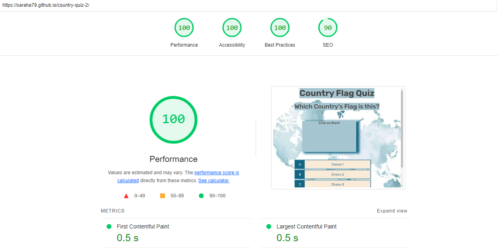

# Country Flag Quiz

This project is a web-based quiz created to provide users with a fun and interactive way to test their knowledge on the flags of the world. The quiz was inspired by a7 year old whos inquisitive mind has fallen in love with flags so the design was to be as user-friendly, and engaging as possible with features such as animated confetti upon successful completion.

[Link to live site](https://SarahA79.github.io/country-quiz-2)

---

## CONTENTS

- [User Experience (UX)](#user-experience-ux)
  - [User Stories](#user-stories)
- [Design](#design)
  - [Colour Scheme](#colour-scheme)
  - [Typography](#typography)
  - [Imagery](#imagery)
- [Features](#features)
  - [Future Implementations](#future-implementations)
- [Technologies Used](#technologies-used)
  - [Languages Used](#languages-used)
  - [Frameworks, Libraries & Programs Used](#frameworks-libraries--programs-used)
- [Deployment & Local Development](#deployment--local-development)
  - [Deployment](#deployment)
  - [Local Development](#local-development)
    - [How to Fork](#how-to-fork)
    - [How to Clone](#how-to-clone)
- [Testing](#testing)
- [Credits](#credits)
  - [Code Used](#code-used)
  - [Content](#content)
  - [Media](#media)
  - [Acknowledgments](#acknowledgments)

---

## User Experience (UX)

### Initial Discussion
This quiz is designed for users interested in flags amd geography. The goal is to create an engaging and informative quiz experience that allows users to test their knowledge and enhance knowledge of basic facts about each of the countries on selecting the correct answers.

### Key Information for the Site
- **Introduction to the Quiz**: When a user starts the game a flag will load and 4 options will be displayed for the user to guess the correct answer. when they are correct they will be given 10 points and relevent information about each country as an addition to their growing understanding of the country.
- **Questions and Feedback**: Users can answer questions and receive immediate feedback with the use of multpily choice and alerts.
- **Fun and Engaging Elements**: Features include confetti to celebrate quiz completion. Scores for future leaderboard implentation and immedite feedback that the user can be rewarded with.

### User Stories

**Client Goals**
- Provide a responsive quiz experience across devices.
- Offer a seamless user experience with clear navigation and feedback.
- Encourage users to want to play the quiz and repeat for further education and improvement in knowledge base.

**First Time Visitor Goals**
- Understand the purpose of the quiz and how to participate.
- Easily navigate through the questions and submit answers.
- Receive immediate feedback on their performance.

**Returning Visitor Goals**
- Attempt the quiz again to improve their score.
- Share the quiz with friends or on social media.
- Access additional related content or quizzes.

**Frequent Visitor Goals**
- Regularly check for new quizzes or updates.
- Provide feedback or suggest new quiz topics.
- Track progress over time and compare scores with others.

## Design

### Colour Scheme
The quiz site uses a blue colour scheme that aligns with the theme of the world. The colors are chosen to create a visually appealing and engaging user experience while maintaining readability and accessibility.
colours used were #116688 as the base color shade with tones of this used for consistency where needed and I used #444 for a contrasting font for accessibility.

### Wireframes
## Mobile wireframe

## Tablet and PC Wireframe

### Typography
The site utilizes the Rubik font for all text elements, ensuring consistency and readability across different devices and screen sizes. Where Rubik is unavailable there is the fonts Verdana, Geneva, Tahoma, sans-serif to fall back on for consistency and readability.

### Imagery
Images are used to enhance the user experience by providing visual context for the quiz questions. All images are either sourced from [Image Source] or created specifically for the project.

## Features

### General Features on Each Page
- **Easily understandably options**: Ensures the options are easily selected with hover background to highlight where the pointer is.
- **Interactive Feedback**: Users receive instant feedback on their answers, including confetti animations for correct answers or quiz completion.

### Future Implementations
- **Additional Quizzes**: Expanding the site to include multiple different levels of difficulty.
- **Leaderboard**: A feature allowing users to see how they rank compared to others.
- **Social Sharing**: Options to share quiz results on social media platforms.
- **implement full accessibility**: Currently mobile device rendering is off centered and needs adjusting and added functionality for screeen readers and alternative image text 
-**Fix Confetti**: loading time and placement to be adjusted in future fixes.

### Accessibility
The site is designed with accessibility in mind, using semantic HTML, descriptive alt attributes for images, and ensuring sufficient color contrast. The site has been tested with various accessibility tools to ensure a positive experience for all users.

## Technologies Used

### Languages Used
- HTML
- CSS
- JavaScript

### Frameworks, Libraries & Programs Used
- **JSConfetti**: For the confetti animations used in the quiz.
- **Google Fonts**: To import the fonts used on the website.
- **Font Awesome**: For icons used throughout the site.
- **GitHub**: For version control and project hosting.

## Deployment & Local Development

### Deployment
The site is deployed on GitHub Pages. You can view the live site at [https://sarahA79.github.io/country-quiz-2].

### Local Development

#### How to Fork
1. Log in to GitHub and locate the repository country-quiz-2.
2. Click the "Fork" button at the top right of the repository page.
3. You now have a copy of the repository in your GitHub account.

#### How to Clone
1. Log in to GitHub and locate the repository.
2. Click "Clone or download" and copy the repository URL.
3. Open your terminal, navigate to your desired directory, and run `git clone [repository URL]`.

## Testing

### Validator Testing
- **HTML**: No errors were found when passing through the official [W3C validator](https://validator.w3.org/).

- **CSS**: No errors were found when passing through the official [Jigsaw validator](https://jigsaw.w3.org/css-validator/).

-**Lighthouse test**: 

### Manual Testing
- **Quiz Functionality**: Verified that questions load correctly, answers are processed, and feedback with Info about the country is provided when user selects correct answer.
- **Confetti Animation**: Tested the confetti animation to ensure it triggers correctly on quiz completion.- Not working quite as intended as it shows only after selecting run quiz again at the final prompt.
- **Accessibility**: Ran accessibility tests to ensure the site is usable as much as possible with further accessibility needed such as alt text for the flag images and screen reader properties for the options.
- **Error handling**: 404 page created to alert and send user back to index. Page loads as needed.

## Bugs found and unfixed
- **Quiz Functionality**: End of quiz prompts user for either starting again or cancelling but the final question remains loaded on the screen. Fix  would be to clear the data and display final result and score in future feature.

- **Confetti Animation**: Confetti loading is slow and doesn't display smoothly at all times. It also doesnt load in until user makes the final selection on the prompt to either reload the quiz or quit.

- **Accessibility**: Full accessibilty features not currently implemented as above. future feature to add in screen reader and alt text for all users to be able to use the site fully.

- **Error handling**: Page loads but not picking up on styling. Future feature to fix the styling of the error page.

## Credits

### Code Used
Some code snippets were adapted from Vernell Clark, particularly the confetti animation logic.

Initial quiz page setup was based on James Q Quicks build a quiz app

### Content
All content was created by [Sarah Ankers] and inspired by my sons current fascination for flags.

### Media
Background map was sourced from <a href="https://www.freepik.com/free-vector/blue-watercolor-map-world_20157123.htm#query=blue%20world%20map&position=8&from_view=keyword&track=ais_hybrid&uuid=3dda3828-b09e-42fb-8473-744c07eb1d06">Image by Vectonauta</a> on Freepik - World map in watercolour.

Country flags were sourced from the wikipedia pages for each country 

### Acknowledgments
Special thanks to Vernell Clark for hs ever supoortive and critical eyes to help and guide me on areas where my knowledge and experience lacked and the moral support needed in the final hours, Code Institute for the opportunity to learn from and their review of my projects.
